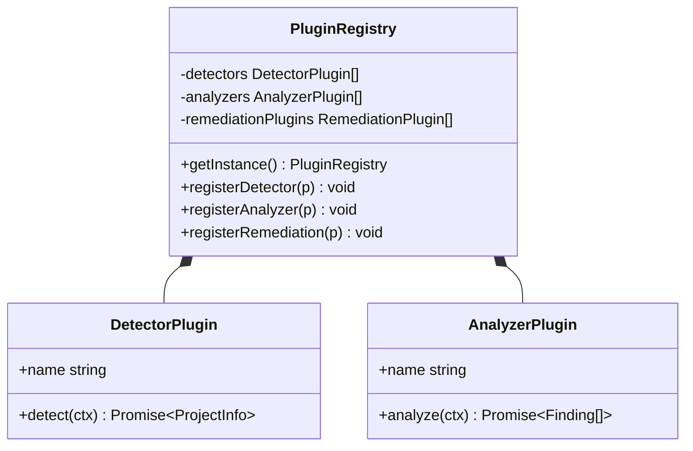
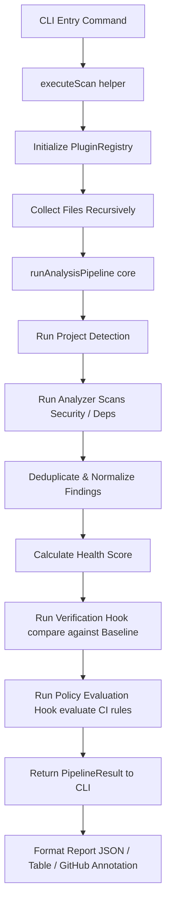

# DevFoundry Architecture Guide

This document describes the architectural layout, core systems, execution pipeline, and extensibility patterns of the DevFoundry security analysis framework.

---

## 1. Monorepo Package Layout

DevFoundry is structured as a TypeScript monorepo managed by `pnpm` and built using `TurboRepo`. The codebase is divided into independent, decoupled packages and applications:

```text
C:/Companygithub/devfoundry/
├── apps/
│   └── cli/                # Command-Line Interface command definitions & orchestrator
├── packages/
│   ├── core/               # Unified pipeline interface, score calculator, and plugin/rule registries
│   ├── detector/           # Project type and framework detection logic
│   ├── security/           # Secret scanning engine for credential detection
│   ├── dependencies/       # Manifest and lockfile parsers (Node.js) & OSV.dev client
│   ├── verification/       # Baseline comparator and verification logic
│   ├── policy/             # Policy engine evaluating new and critical findings
│   ├── remediation/        # Advice generator and remediation planner (no automated mutation)
│   ├── reporter/           # Clean terminal and stable JSON formatting layouts
│   └── integrations/
│       └── github/         # GHA Annotations & job summaries for PR checks
└── docs/
    └── architecture.md     # This documentation
```

---

## 2. Pluggable Plugin Registry

The core package exposes a pluggable architecture to keep analysis tasks, scanners, and rules modular and decoupled.



- **DetectorPlugin**: Identifies the project type, package manager, and framework components (e.g. Next.js, Vite).
- **AnalyzerPlugin**: Runs security or dependency analysis on the target workspace files and returns a normalized array of findings.
- **RuleRegistry**: A central metadata database containing descriptors (severity, description, and remediation tips) for secrets (`github-token`, `aws-access-key`, etc.) and dependency vulnerabilities (`dependency-vulnerability`).

---

## 3. Unified Analysis Pipeline Flow

DevFoundry uses a single, unified execution orchestrator called `runAnalysisPipeline` defined in `packages/core/src/pipeline.ts`. 

All user-facing CLI commands (`scan`, `doctor`, `verify`, `ci`) route through this pipeline. This guarantees deterministic behavior, consistent scoring, and centralized verification logic.



---

## 4. Design Invariants and Safety Boundaries

1. **Zero Cloud Uploads**: Analysis is done locally on the developer's machine. The only outgoing network call is to the public OSV.dev vulnerability database to cross-reference package names and versions. Source code, secrets, and repository structures never leave the local environment.
2. **Deterministic Offline Fallbacks**: Running with `--offline` automatically substitutes `OsvAdvisoryProvider` with `NoOpAdvisoryProvider`, disabling network requests and reporting advisory status as `not_checked`.
3. **No Automatic Mutations**: Remediation planning generates explainable suggestions (`RemediationPlan`) but never modifies files or rotates credentials automatically. 
4. **Verification Status Invariants**:
    - If all security findings are resolved and dependency advisories checked: **PASSED**
    - If security findings are resolved but dependency advisories are unavailable/unchecked: **PARTIAL**
    - Under no circumstances can a dependency vulnerability warning verify as **PASSED** if advisories are unavailable.
